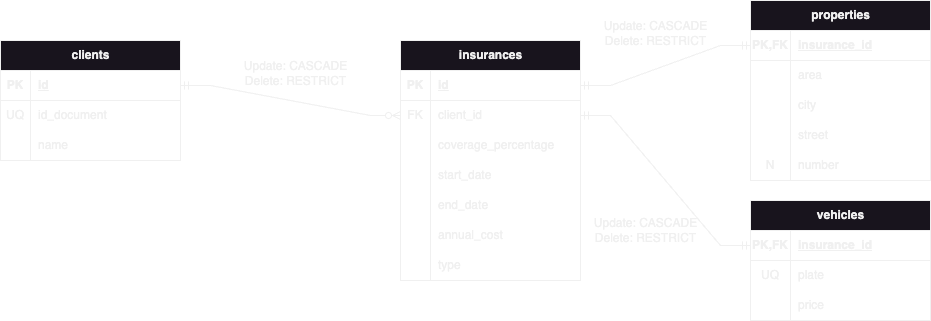

# 1. Task list

We want to make an application where every user can create a task list, being able to add tasks and mark them as complete.

The users will register with their email and a password. We will want to store their full name as well.

For each task we want to store the following information:
- Title
- Description
- State (done or in progress)
- Due date

<details>
<summary>Conceptual design</summary>


</details>

<details>
<summary>Logic design</summary>


</details>

<details>
<summary>Physical design</summary>

```sql
CREATE database task_lists;
USE task_lists;

CREATE TABLE users (
    id INT UNSIGNED AUTO_INCREMENT PRIMARY KEY,
    name VARCHAR(255) NOT NULL,
    email VARCHAR(255) UNIQUE NOT NULL,
    password VARCHAR(255) NOT NULL
);

CREATE TABLE tasks (
  id INT UNSIGNED AUTO_INCREMENT PRIMARY KEY,
  user_id INT UNSIGNED NOT NULL,
  title VARCHAR(255) NOT NULL,
  description TEXT NOT NULL,
  status ENUM('todo', 'in_progress', 'done') NOT NULL DEFAULT 'todo',
  due_date DATETIME NOT NULL,

  FOREIGN KEY (user_id) REFERENCES users(id)
      ON UPDATE  CASCADE
      ON DELETE  CASCADE
);

```
</details>

# 2. Taxis

We want to store the information about taxi drivers of our province and their cars.

For every driver we want to know its name and phone number. And for every car we want to know the brand, model and plate number. Additionally,
we need to store images of the cars to follow up on the conditions of the cars in case they have an accident.

In the province there are several garages where the cars will be parked at the end of the day. Each garage has an address and the number
of cars that can be parked there.

Each car can only be drive by one driver at the same time, and the application will allow us to define the period of time that the driver
will be driving the car.

<details>
<summary>Conceptual design</summary>


</details>

<details>
<summary>Logic design</summary>


</details>

<details>
<summary>Physical design</summary>

```sql
CREATE database taxis;
USE taxis;

CREATE TABLE drivers (
    id INT UNSIGNED AUTO_INCREMENT PRIMARY KEY,
    name VARCHAR(255) NOT NULL,
    phone_number VARCHAR(255) NOT NULL
);

CREATE TABLE garages (
    id INT UNSIGNED AUTO_INCREMENT PRIMARY KEY,
    city VARCHAR(255) NOT NULL,
    street VARCHAR(255) NOT NULL,
    number VARCHAR(255) NOT NULL
);

CREATE TABLE vehicles (
    id INT UNSIGNED AUTO_INCREMENT PRIMARY KEY,
    garage_id INT UNSIGNED,
    plate_number VARCHAR(255) UNIQUE NOT NULL,
    brand VARCHAR(255) NOT NULL,
    model VARCHAR(255) NOT NULL,

    FOREIGN KEY (garage_id) REFERENCES garages(id)
        ON UPDATE  CASCADE
        ON DELETE  SET NULL
);

CREATE TABLE vehicle_image (
    vehicle_id INT UNSIGNED NOT NULL,
    url VARCHAR(255) NOT NULL,

    FOREIGN KEY (vehicle_id) REFERENCES vehicles(id)
        ON UPDATE  CASCADE
        ON DELETE  CASCADE
);

CREATE TABLE driver_vehicle (
    driver_id INT UNSIGNED NOT NULL UNIQUE,
    vehicle_id INT UNSIGNED NOT NULL UNIQUE,
    start_date DATETIME NOT NULL,
    end_date DATETIME NOT NULL,

    FOREIGN KEY (driver_id) REFERENCES drivers(id)
        ON UPDATE  CASCADE
        ON DELETE  CASCADE,
    FOREIGN KEY (vehicle_id) REFERENCES vehicles(id)
        ON UPDATE  CASCADE
        ON DELETE  CASCADE
);

```
</details>

# 3. Chat Rooms

We want to develop an application where users can create chat rooms and assign different roles to each member of the room. 

Users will register with email and password, and we will also store their full name, and they will have a unique username. Each room has an 
owner (the user who initially created it), a name, and a description. The room can be configured as private, so only those with an 
invitation can join. The invitation should be an automatically generated link. If the room is public, no invitation is needed to join.

Room owners can create roles and assign them to other users. For each role, we want to store the name and a description.

Finally, we want to store the date, including hour and minute, of each message sent in each room, as well as the user who sent it.

<details>
<summary>Conceptual design</summary>


</details>

<details>
<summary>Logic design</summary>


</details>

<details>
<summary>Physical design</summary>

```sql
CREATE DATABASE chat_rooms;
USE chat_rooms;

CREATE TABLE users (
    id INT UNSIGNED AUTO_INCREMENT PRIMARY KEY,
    email VARCHAR(255) NOT NULL UNIQUE,
    username VARCHAR(255) NOT NULL UNIQUE,
    password VARCHAR(255) NOT NULL,
    name VARCHAR(255) NOT NULL
);

CREATE TABLE chat_rooms (
    id INT UNSIGNED AUTO_INCREMENT PRIMARY KEY,
    owner_id INT UNSIGNED NOT NULL,
    name VARCHAR(255) NOT NULL,
    description TEXT NOT NULL,
    is_private BOOLEAN NOT NULL,

    FOREIGN KEY (owner_id) REFERENCES users(id)
        ON UPDATE  CASCADE
        ON DELETE  CASCADE
);

CREATE TABLE roles (
    id INT UNSIGNED AUTO_INCREMENT PRIMARY KEY,
    room_id INT UNSIGNED NOT NULL,
    name VARCHAR(255) NOT NULL,
    description TEXT NOT NULL,

    FOREIGN KEY (room_id) REFERENCES chat_rooms(id)
        ON UPDATE  CASCADE
        ON DELETE  CASCADE
);

CREATE TABLE user_role (
    user_id INT UNSIGNED NOT NULL,
    role_id INT UNSIGNED NOT NULL,

    PRIMARY KEY (user_id, role_id),

    FOREIGN KEY (user_id) REFERENCES users(id)
        ON UPDATE  CASCADE
        ON DELETE  CASCADE,

    FOREIGN KEY (role_id) REFERENCES roles(id)
        ON UPDATE  CASCADE
        ON DELETE  CASCADE
);

CREATE TABLE user_room (
    user_id INT UNSIGNED NOT NULL,
    room_id INT UNSIGNED NOT NULL,

    PRIMARY KEY (user_id, room_id),

    FOREIGN KEY (user_id) REFERENCES users(id)
        ON UPDATE  CASCADE
        ON DELETE  CASCADE,

    FOREIGN KEY (room_id) REFERENCES chat_rooms(id)
        ON UPDATE  CASCADE
        ON DELETE  CASCADE
);

CREATE TABLE invitations (
    user_id INT UNSIGNED NOT NULL,
    room_id INT UNSIGNED NOT NULL,

    PRIMARY KEY (user_id, room_id),

    FOREIGN KEY (user_id) REFERENCES users(id)
        ON UPDATE  CASCADE
        ON DELETE  CASCADE,

    FOREIGN KEY (room_id) REFERENCES chat_rooms(id)
        ON UPDATE  CASCADE
        ON DELETE  CASCADE
);

CREATE TABLE messages (
    user_id INT UNSIGNED NOT NULL,
    room_id INT UNSIGNED NOT NULL,
    content TEXT NOT NULL,
    date DATETIME NOT NULL,

    FOREIGN KEY (user_id) REFERENCES users(id)
        ON UPDATE  CASCADE
        ON DELETE  CASCADE,

    FOREIGN KEY (room_id) REFERENCES chat_rooms(id)
        ON UPDATE  CASCADE
        ON DELETE  CASCADE
);

```
</details>

# 4. Insurance Company

Our company needs to store data about its clients and the insurance policies they have acquired. For each client, we want to know their 
identity document number and full name.

The insurance policies can cover repair expenses in case of damages to properties (houses, apartments, etc.) or vehicles. In the case of 
properties, we are interested in storing the total square meters of the property as well as its address, while for vehicles we want to 
store their purchase price and license plate number. This information will be used to calculate the annual cost of the insurance that the 
client will need to pay.

The client will be able to choose the percentage of the total repair expenses that the insurance will cover when contracting it, for 
example, 40%. This data will also be necessary to calculate the annual price.

<details>
<summary>Conceptual design</summary>


</details>

<details>
<summary>Logic design</summary>



</details>

<details>
<summary>Physical design</summary>

```sql
CREATE DATABASE insurance_company;
USE insurance_company;

CREATE TABLE clients (
    id INT UNSIGNED AUTO_INCREMENT PRIMARY KEY,
    id_document VARCHAR(255) NOT NULL UNIQUE,
    name VARCHAR(255) NOT NULL
);

CREATE TABLE insurances (
    id INT UNSIGNED AUTO_INCREMENT PRIMARY KEY,
    client_id INT UNSIGNED NOT NULL,
    coverage_percentage TINYINT UNSIGNED NOT NULL,
    start_date DATETIME NOT NULL,
    end_date DATETIME NOT NULL,
    annual_cost DECIMAL(8, 2) NOT NULL,
    type ENUM('property', 'vehicles') NOT NULL,

    FOREIGN KEY (client_id) REFERENCES clients(id)
        ON UPDATE CASCADE
        ON DELETE RESTRICT,

    CHECK (coverage_percentage <= 100)
);

CREATE TABLE properties (
    insurance_id INT UNSIGNED AUTO_INCREMENT PRIMARY KEY,
    area DECIMAL(6, 2) NOT NULL,
    city VARCHAR(255) NOT NULL,
    street VARCHAR(255) NOT NULL,
    number VARCHAR(255),

    FOREIGN KEY (insurance_id) REFERENCES insurances(id)
        ON UPDATE CASCADE
        ON DELETE RESTRICT
);

CREATE TABLE vehicles (
    insurance_id INT UNSIGNED AUTO_INCREMENT PRIMARY KEY,
    plate_number VARCHAR(255) NOT NULL UNIQUE,
    price DECIMAL(8, 2) NOT NULL,

    FOREIGN KEY (insurance_id) REFERENCES insurances(id)
        ON UPDATE CASCADE
        ON DELETE RESTRICT
);

```
</details>

# 5. Departments and Employees

Our company has several offices located in different buildings, and each of them contains various departments. The buildings have an 
associated number, which is unique among buildings in the same city but can be repeated for buildings in different cities.

For the departments, we want to store their name, which is unique, their department number, which is also unique, and their annual budget. 
Additionally, we want to know in which department each employee works, for which we have their employee number, which is unique within each 
department but can be repeated for employees in different departments. Finally, employees can be in charge of other employees, and we want 
to store this information.

<details>
<summary>Conceptual design</summary>


</details>

<details>
<summary>Logic design</summary>


</details>

<details>
<summary>Physical design</summary>

```sql
CREATE DATABASE departments_and_employees;
USE departments_and_employees;

CREATE TABLE buildings (
    number INT UNSIGNED NOT NULL,
    city VARCHAR(255) NOT NULL,

    PRIMARY KEY (number, city)
);

CREATE TABLE departments (
    number VARCHAR(255) PRIMARY KEY,
    building_number INT UNSIGNED NOT NULL,
    building_city VARCHAR(255) NOT NULL,
    name VARCHAR(255) NOT NULL UNIQUE,
    annual_budget DECIMAL(8, 2) NOT NULL,

    FOREIGN KEY (building_number, building_city) REFERENCES buildings(number, city)
        ON UPDATE CASCADE
        ON DELETE RESTRICT
);

CREATE TABLE employees (
    number INT UNSIGNED NOT NULL,
    department_number VARCHAR(255) NOT NULL,
    name VARCHAR(255) NOT NULL,
    manager_number INT UNSIGNED NOT NULL,
    manager_department_number VARCHAR(255) NOT NULL,

    PRIMARY KEY (number, department_number),

    FOREIGN KEY (department_number) REFERENCES departments(number)
        ON UPDATE CASCADE
        ON DELETE RESTRICT,

    FOREIGN KEY (manager_number, manager_department_number) 
        REFERENCES employees(number, department_number)
        ON UPDATE CASCADE
        ON DELETE RESTRICT
);

```
</details>

# 6. Social Network

We are going to develop an application similar to Instagram where users can upload posts to their profile and follow other users.

Users will register with an email and password, but they will need to choose a unique username and a profile picture (the picture is 
optional) to complete the registration. If the data is valid, a profile will be automatically created for them upon registration.

A user can follow other users’ profiles to see their content and can upload posts to their own profile for others to see. Each post can 
have a maximum of 10 images, will also have an optional description, and we will store the post’s creation date.

Users will be able to write comments on other users’ posts or on their own posts. For each comment, we are interested in storing the text 
and the date it was published.

<details>
<summary>Conceptual design</summary>


</details>

<details>
<summary>Logic design</summary>


</details>

<details>
<summary>Physical design</summary>

```sql
CREATE DATABASE social_network;
USE social_network;

CREATE TABLE users (
    id INT UNSIGNED AUTO_INCREMENT PRIMARY KEY,
    name VARCHAR(255) NOT NULL,
    email VARCHAR(255) NOT NULL UNIQUE,
    password VARCHAR(255) NOT NULL
);

CREATE TABLE profiles (
    id INT UNSIGNED AUTO_INCREMENT PRIMARY KEY,
    user_id INT UNSIGNED NOT NULL,
    username VARCHAR(255) NOT NULL UNIQUE,
    picture VARCHAR(255),

    FOREIGN KEY (user_id) REFERENCES users(id)
        ON UPDATE CASCADE
        ON DELETE CASCADE
);

CREATE TABLE posts (
    id INT UNSIGNED AUTO_INCREMENT PRIMARY KEY,
    profile_id INT UNSIGNED NOT NULL,
    creation_date DATETIME NOT NULL,
    description TEXT,

    FOREIGN KEY (profile_id) REFERENCES profiles(id)
        ON UPDATE CASCADE
        ON DELETE CASCADE
);

CREATE TABLE follows (
    follower_profile_id INT UNSIGNED NOT NULL,
    followed_profile_id INT UNSIGNED NOT NULL,

    PRIMARY KEY (follower_profile_id, followed_profile_id),

    FOREIGN KEY (follower_profile_id) REFERENCES profiles(id)
        ON UPDATE CASCADE
        ON DELETE CASCADE,

    FOREIGN KEY (followed_profile_id) REFERENCES profiles(id)
        ON UPDATE CASCADE
        ON DELETE CASCADE
);

CREATE TABLE comments (
    profile_id INT UNSIGNED NOT NULL,
    post_id INT UNSIGNED NOT NULL,
    date DATETIME NOT NULL,
    content TEXT,

    FOREIGN KEY (profile_id) REFERENCES profiles(id)
        ON UPDATE CASCADE
        ON DELETE CASCADE,

    FOREIGN KEY (post_id) REFERENCES posts(id)
        ON UPDATE CASCADE
        ON DELETE CASCADE
);

CREATE TABLE post_images (
    post_id INT UNSIGNED NOT NULL,
    url VARCHAR(255) NOT NULL,

    FOREIGN KEY (post_id) REFERENCES posts(id)
        ON UPDATE CASCADE
        ON DELETE CASCADE
);

```
</details>

# Challenge: Ecommerce

We want to create a marketplace similar to Amazon where users can create stores and sell their products online. Users will register with an 
email and password, and we will also store their full name.

For each store, we want to store its name and the user it belongs to, as well as the products it sells. For each product, we will store its
name, a description, the current stock, the current price, and the current discount. Additionally, some products may have different sizes 
and colors (for example, a monitor may be available in different resolutions and sizes), so we want to allow users to store this information. 
Finally, each product will have at least one image or several. Products are unique to each store, meaning that even if multiple stores sell 
the same product, each store has to create it separately in the application and add its name, images, etc.

Users, in addition to selling, can buy products from other stores. To do this, they will need to create an order in which we will store the 
products included, the quantity of each product, the color and size of each product (if applicable), the price of each product (since it 
can change in the future), and the discount applied (which can also change in the future). We will also calculate the total purchase price 
and add an invoice number to be able to send it to the buyer later.

Additionally, we need to know where to send the package, so users can associate multiple shipping addresses with their account and choose 
one when creating an order. The address will consist of the following fields: country, state/province, city, street, number, and optionally,
unit (apartment number, door, etc.). We will store this address along with the other order fields. Finally, since the order may take several
days to be prepared, shipped, and delivered, we want to store its status (“processing,” “shipped,” “delivered,” “canceled”).

<details>
<summary>Conceptual design</summary>


</details>

<details>
<summary>Logic design</summary>


</details>